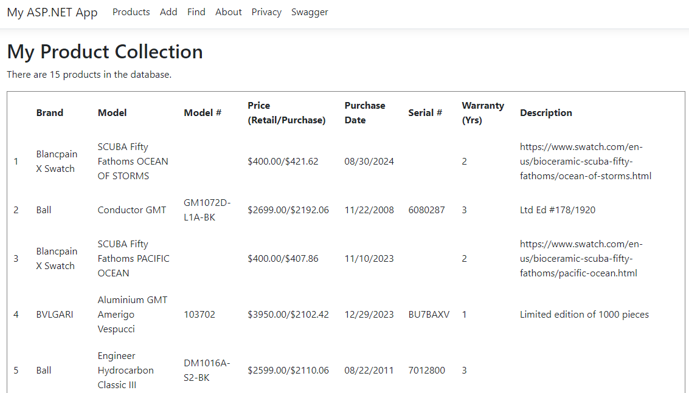
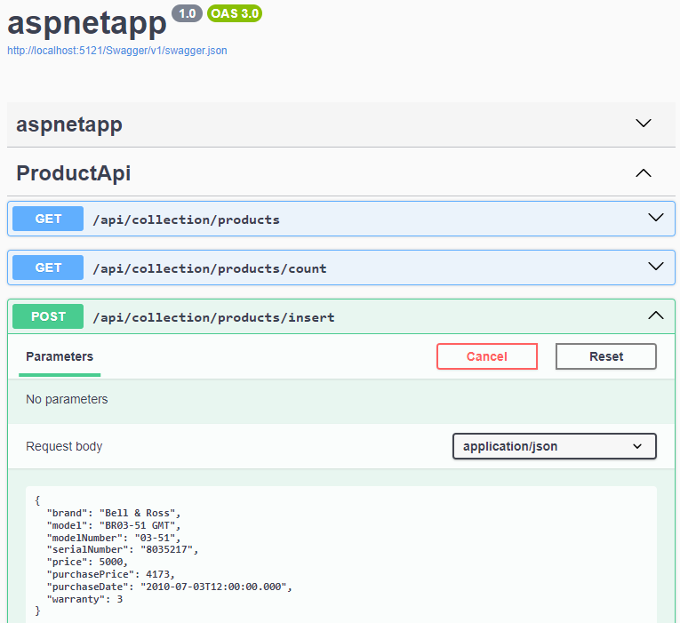

# ASP.NET with Docker and MongoDB

Containerize ASP.NET app with Docker and MongoDB CRUD (Create, Read, Update, and Delete)<br/>
Using [.NET 8.0](https://dotnet.microsoft.com/en-us/download/dotnet/8.0)

## Build the image and run in Docker container

The ASP.NET container image is built with [Ubuntu Chiseled](https://devblogs.microsoft.com/dotnet/dotnet-6-is-now-in-ubuntu-2204/#net-in-chiseled-ubuntu-containers), with [Dockerfile](Dockerfile.chiseled-composite)

```console
docker build -t aspnetapp-mongodb .
docker-compose --env-file docker-compose-dev.env up -d
```

Navigate to http://localhost:8000



## Run and debug the app locally

Navigate to the project folder [aspnetapp](aspnetapp)

```console
dotnet run
```
Navigate to http://localhost:5121<br/>
Press `Ctrl+C` at the command prompt to stop the app

## ASP.NET Project

Project Layout
- `wwwroot` folder
- Dependencies: Analyzers, NuGet packages, no direct DLL references
- Configuration through `appsettings.json`
- `Program.cs`: The ASP.NET application

`Application`: creates the ASP.NET host and configures and starts the web app<br/>
`Middleware`: software assembled into an app pipeline to handle requests and responses<br/>
`Server`: accepts HTTP requests<br/>
`Host`: responsible for app startup and lifetime management, wrapper around the server<br/>

Supported hosts
- `Kestrel`: default, cross-platform HTTP server
- `IIS`: Internet Information Services used as reverse proxy with Kestrel

Model View Controller ([MVC](https://learn.microsoft.com/en-us/aspnet/core/tutorials/first-mvc-app/start-mvc?view=aspnetcore-6.0)) pattern
- Model
  - MongoDB Create, Read, Update & Delete (CRUD)
- View
  - [Razor Pages](https://learn.microsoft.com/en-us/aspnet/core/tutorials/razor-pages/razor-pages-start?view=aspnetcore-6.0&tabs=visual-studio)
  - Build interactive web UIs using C#
  - Recommended for developers new to ASP.NET Core
  - Pass data from controllers to views
  -  Implement GET, POST, PUT, DELETE scenarios
- Controllers
  - Handle incoming browser requests
  - Retrieve model data
  - Specify view templates that return a response to the browser
- API Controllers
  - Implement CRUD API using HttpPost, HttpPut, HttpDelete and HttpGet actions
  - Use [Swagger](https://learn.microsoft.com/en-us/aspnet/core/tutorials/web-api-help-pages-using-swagger?view=aspnetcore-6.0) to document and test Web APIs in the project

## Notes

- Project requires [MongoDB.Driver](https://www.nuget.org/packages/MongoDB.Driver) NuGet package
- Use swagger to view and execute Web APIs http://localhost:8000/swagger



## References

- [Run an ASP.NET Core app in Docker containers](https://learn.microsoft.com/en-us/aspnet/core/host-and-deploy/docker/building-net-docker-images?view=aspnetcore-8.0)
